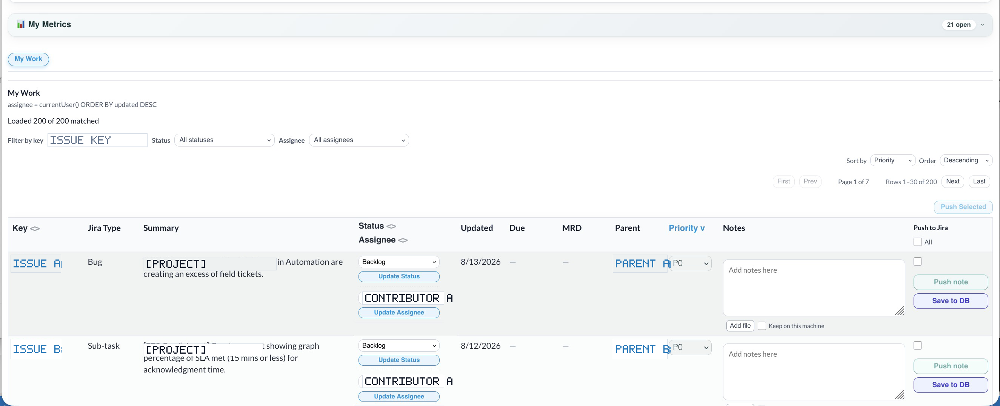
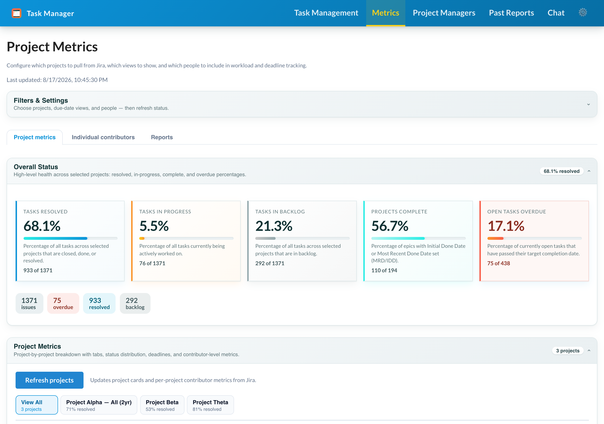
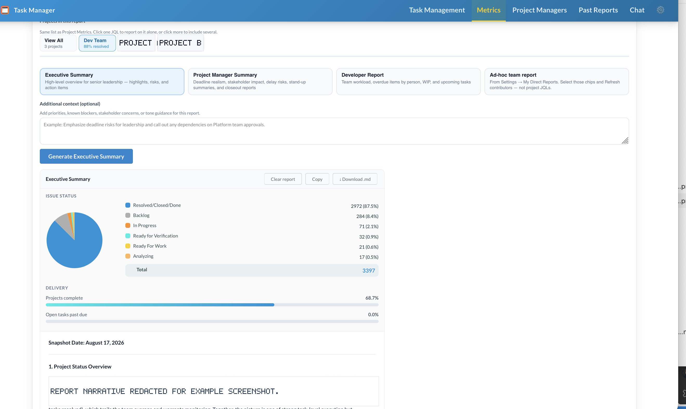
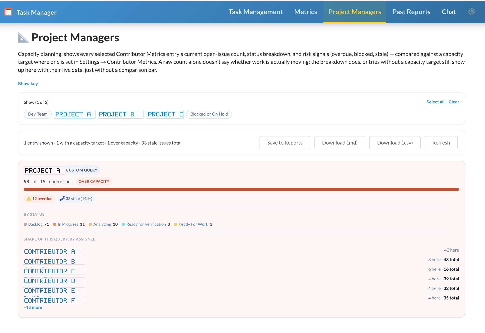
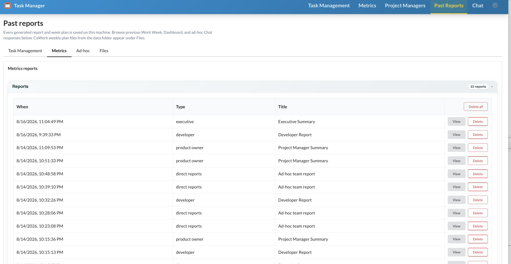
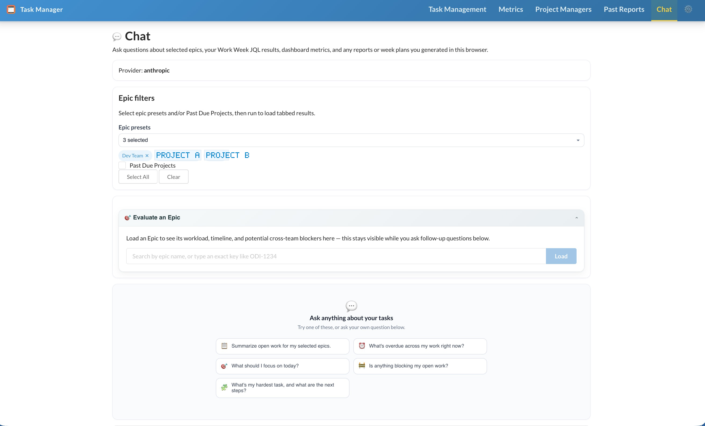
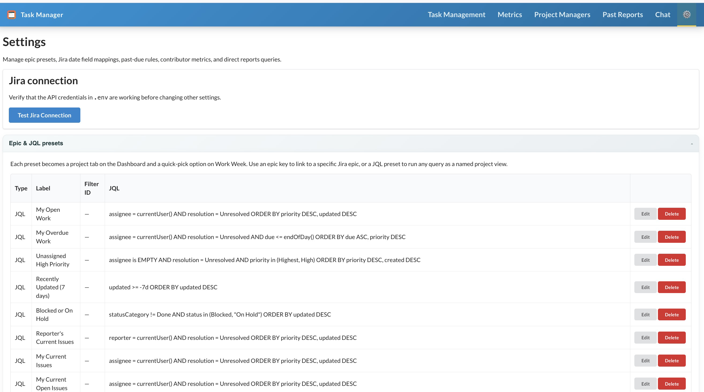

# Task Manager

> A personal desktop productivity tool for Jira power users — Jira-connected, AI-powered, and built for one person's daily workflow.

---

## Overview

Task Manager is a private desktop and browser app for Jira-heavy work. It replaces the daily shuffle between Jira views, Excel trackers, and status-update drafts with one local workspace.

The app talks to **your Jira project (ODI)** through a local Express proxy. Jira credentials stay in your local `.env`; no third-party cloud service receives them.

---

## App tabs

| Tab | Use it for | Key outputs |
|-----|------------|-------------|
| Task Management | Daily JQL runs, issue edits, notes, priorities, create issue | Per-query metrics, project reports, week plans |
| Metrics | Project and contributor health across saved epics/JQL presets | Metrics snapshot, audience reports, weekly digest |
| Project Managers | Capacity planning from Contributor Metrics entries | Capacity cards, `.md` / `.csv` exports, saved reports |
| Past Reports | Archived generated outputs and saved Chat replies | View, copy, download, or delete local report records |
| Chat | Natural-language Jira questions with app session context | Jira-backed answers, optional save to Past Reports |
| Settings | Jira setup, presets, field mappings, report/chat preferences | Shared preset packs and connection checks |

**Task Management** is the daily driver. Run up to five saved JQL queries, update status or assignee, set P1-P20 priority, write notes, push notes to Jira, create ODI issues, and generate AI reports or week plans from the loaded work.

**Metrics** is the project view. Pick saved Epic/JQL presets, refresh a Jira snapshot, review overall/project/contributor metrics, inspect due-date lists, and generate leadership or team-facing reports.

**Project Managers** turns Contributor Metrics entries into a capacity view. It compares open issue counts against optional capacity targets, highlights overdue/blocked/stale work, and exports planning summaries.

**Past Reports** is the local archive for generated Task Management reports, week plans, Metrics reports, and Chat replies saved with **Save to Past Reports**.

**Chat** answers Jira questions using selected presets, recent Task Management JQL results, the latest Metrics snapshot, and generated reports/plans already in the session. Chat works with Anthropic, OpenAI-compatible providers, Ollama, or opt-in Rovo.

**Settings** is where you configure Jira credentials checks, Epic/JQL presets, Jira date-field mappings, past-due rules, Contributor Metrics entries, Work Week header preferences, and custom Chat instructions.

---

## Example views

Actual screenshots from the running app with project and contributor names redacted. Content may vary by local Jira presets, saved browser state, and connection settings.















---

## Who it's for

Task Manager is built for **engineers and project managers** who work in Jira daily and want a faster, smarter alternative to juggling raw Jira views, spreadsheets, and status-update emails.

The app is designed around a single Jira project (ODI) on your organization's Atlassian instance and will be distributed to team members once development is complete. All Jira credentials stay on each user's machine — no third-party cloud service ever sees them.

**Primary use cases:**
- Engineers who need a focused daily view of their assigned work across multiple queries
- PMs and leads who track project health across several epics at once
- Anyone who writes weekly status updates and wants them generated from real data
- Team leads monitoring individual contributor workloads and deadlines

---

## Quick start

Works on **macOS and Windows** (and Linux for browser dev).

**macOS / Linux (Terminal):**
```bash
# 1. Use the pinned Node version (once per new shell)
nvm install
nvm use

# 2. Install dependencies (once)
npm install

# 3. Copy and fill in credentials (once)
cp .env.example .env
# → edit .env with your JIRA_BASE_URL, JIRA_EMAIL, JIRA_API_TOKEN

# 4. Start (pick one)
npm run dev:all        # browser at http://localhost:5173
npm run desktop:dev    # Electron desktop window
```

**Windows (PowerShell):**
```powershell
# 1. Node 22 required — install from nodejs.org or nvm-windows, then verify:
node -v

# 2. Install dependencies
npm install

# 3. Copy credentials template
Copy-Item .env.example .env
# → edit .env with Notepad or your editor

# 4. Start (pick one)
npm run dev:all
npm run desktop:dev
```

Some corporate secure laptops may block Electron windows, unsigned installers, local desktop apps, or the embedded proxy. If `npm run desktop:dev` or the packaged app is unavailable, run `npm run dev:all` and install the browser UI as its own desktop-style app window; see [END_USER_GUIDE.md](./docs/END_USER_GUIDE.md#install-as-its-own-application-window).

**Packaged desktop (no Node required):** install the universal Mac `.dmg` (Intel or Apple Silicon) or Windows NSIS installer, edit `.env` — see [JIRA_SETUP.md](./docs/JIRA_SETUP.md) § Desktop app.

Full setup details → **[JIRA_SETUP.md](./docs/JIRA_SETUP.md)**
Code architecture → **[DEVELOPER_GUIDE.md](./docs/DEVELOPER_GUIDE.md)**
Day-to-day usage → **[END_USER_GUIDE.md](./docs/END_USER_GUIDE.md)**

---

## Data & privacy

| What | Where stored | Leaves your machine? |
|------|-------------|----------------------|
| JQL text, labels, last table snapshot | Browser `localStorage` | No |
| Task Management drill-down tabs | Browser `sessionStorage` | No |
| Chat session artifacts (reports/plans for context) | Browser `localStorage` | No |
| On-page reports/plans (Task Management + Metrics) | Browser `localStorage` | No |
| **Past Reports** archive | `data/workweek.sqlite` → `generated_reports`; saved under your browser's local timestamp/timezone | No |
| Header reminders | Browser `localStorage` | No |
| Per-issue notes + P1–P20 priority | `data/workweek.sqlite` (local file); shared-program slots use Atlas demo / future MySQL | No for personal slots |
| Start date (ad-hoc, for Gantt views) | `data/workweek.sqlite` (local file); same personal/shared split as priority | No for personal slots |
| Status/assignee changes | Jira (your Atlassian instance) | Yes — visible in Jira to anyone with access |
| Due date / MRD changes | Jira (your Atlassian instance) | Yes |
| Notes you push as comments | Jira (your Atlassian instance) | Yes — text and attachments, rendered as markdown (bold/italic/lists/etc.) |
| Metrics snapshot | `data/workweek.sqlite` (dev) or user data folder (packaged desktop) | No |
| Desktop `.env` + local DB (packaged app) | OS user data folder — see [JIRA_SETUP.md](./docs/JIRA_SETUP.md) | No |
| Jira credentials | `.env` file on this machine | No — only the local proxy reads them |
| Chat message content | Your configured LLM provider (Anthropic/OpenAI/etc.) when you send a message | Yes — to that provider's API |

---

## Tech stack (summary)

- **Frontend**: React 18, Vite 8, Semantic UI React, React Router
- **Backend**: Express.js proxy (`server/`), better-sqlite3
- **Desktop**: Electron 31 + electron-builder
- **AI**: Anthropic / OpenAI / Ollama (configurable in `.env`)
- **Database**: SQLite at `data/workweek.sqlite` (auto-created on first run)
